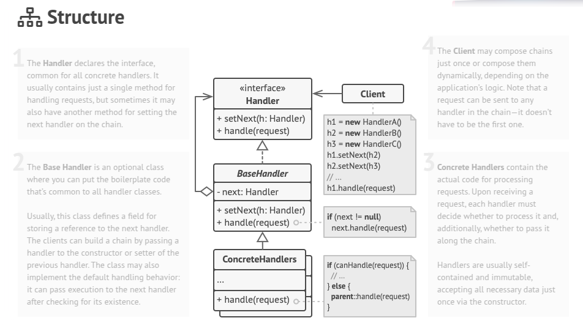
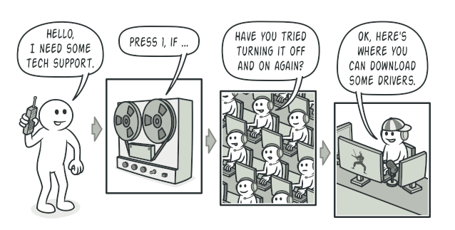

# Chain Of Responsibility

Chain of Responsibility is a behavioral design pattern that lets you pass requests along a chain of handlers. Upon receiving a request, each handler decides either to process the request or to pass it to the next handler in the chain.

## Problem 
While developing an online ordering system, you aimed to restrict access so only authenticated users could create orders, while administrators had full access to all orders. Over time, you implemented sequential security checks, starting with user authentication and adding steps such as data sanitization, protection against brute-force attacks, and caching optimizations. Each new feature made the system more complex, causing the code to become bloated and difficult to maintain. As modifying one check often affected others, reusing these validations across different components required code duplication, further increasing maintenance costs. Eventually, the increasing complexity led you to refactor the entire system for better efficiency and manageability.

## Solution
Like many other behavioral design patterns, the Chain of Responsibility relies on transforming particular behaviors into stand-alone objects called handlers. In our case, each check should be extracted to its own class with a single method that performs the check. The request, along with its data, is passed to this method as an argument.

The pattern suggests that you link these handlers into a chain. Each linked handler has a field for storing a reference to the next handler in the chain. In addition to processing a request, handlers pass the request further along the chain. The request travels along the chain until all handlers have had a chance to process it.

Here’s the best part: a handler can decide not to pass the request further down the chain and effectively stop any further processing.

## Real World Analogy
You’ve just bought and installed a new piece of hardware on your computer. Since you’re a geek, the computer has several operating systems installed. You try to boot all of them to see whether the hardware is supported. Windows detects and enables the hardware automatically. However, your beloved Linux refuses to work with the new hardware. With a small flicker of hope, you decide to call the tech-support phone number written on the box.

The first thing you hear is the robotic voice of the autoresponder. It suggests nine popular solutions to various problems, none of which are relevant to your case. After a while, the robot connects you to a live operator.

Alas, the operator isn’t able to suggest anything specific either. He keeps quoting lengthy excerpts from the manual, refusing to listen to your comments. After hearing the phrase “have you tried turning the computer off and on again?” for the 10th time, you demand to be connected to a proper engineer.

Eventually, the operator passes your call to one of the engineers, who had probably longed for a live human chat for hours as he sat in his lonely server room in the dark basement of some office building. The engineer tells you where to download proper drivers for your new hardware and how to install them on Linux. Finally, the solution! You end the call, bursting with joy.

## Applicability
- Use the Chain of Responsibility pattern when your program is expected to process different kinds of requests in various ways, but the exact types of requests and their sequences are unknown beforehand.
- Use the pattern when it’s essential to execute several handlers in a particular order.
- Use the CoR pattern when the set of handlers and their order are supposed to change at runtime.

## How To Implement
1. Declare the handler interface and describe the signature of a method for handling requests.

2. Decide how the client will pass the request data into the method. The most flexible way is to convert the request into an object and pass it to the handling method as an argument.

3. To eliminate duplicate boilerplate code in concrete handlers, it might be worth creating an abstract base handler class, derived from the handler interface.

4. This class should have a field for storing a reference to the next handler in the chain. Consider making the class immutable. However, if you plan to modify chains at runtime, you need to define a setter for altering the value of the reference field.

5. You can also implement the convenient default behavior for the handling method, which is to forward the request to the next object unless there’s none left. Concrete handlers will be able to use this behavior by calling the parent method.

6. One by one create concrete handler subclasses and implement their handling methods. Each handler should make two decisions when receiving a request:
   * Whether it’ll process the request. 
   * Whether it’ll pass the request along the chain.

7. The client may either assemble chains on its own or receive pre-built chains from other objects. In the latter case, you must implement some factory classes to build chains according to the configuration or environment settings.

8. The client may trigger any handler in the chain, not just the first one. The request will be passed along the chain until some handler refuses to pass it further or until it reaches the end of the chain.

9. Due to the dynamic nature of the chain, the client should be ready to handle the following scenarios:
   * The chain may consist of a single link. 
   * Some requests may not reach the end of the chain. 
   * Others may reach the end of the chain unhandled.
