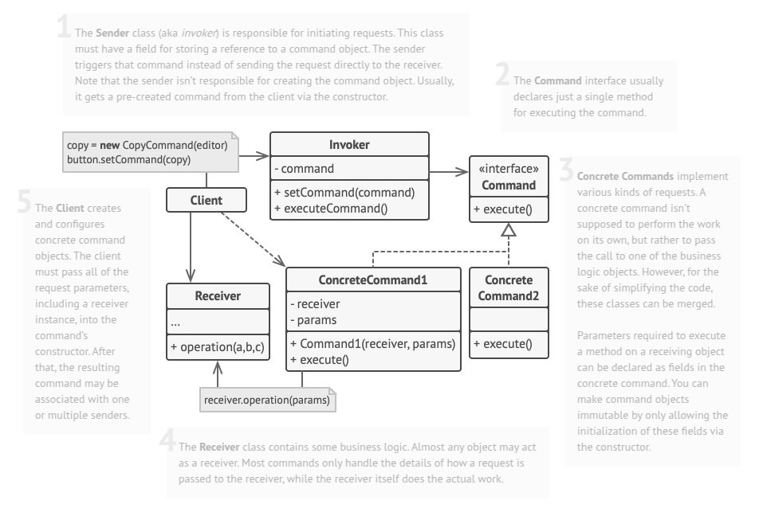
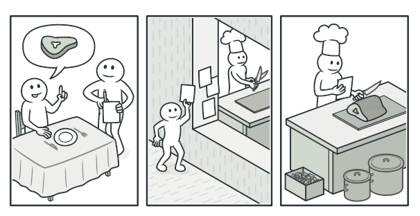

# Command
Command is a behavioral design pattern that turns a request into a stand-alone object that contains all information about the request. This transformation lets you pass requests as a method arguments, delay or queue a request’s execution, and support undoable operations.

## Problem
While developing a new text editor, you set out to create a toolbar with buttons for various editor functions. You designed a versatile Button class that could be used across different components, including dialogs. However, while the buttons shared a common appearance, each needed unique functionality, leading to a rapidly growing number of subclasses—each containing distinct click handlers. Over time, this approach became problematic, as modifying the base Button class risked breaking dependent subclasses, making the GUI tightly coupled with business logic. Additionally, operations like copy and paste needed to be accessible through multiple UI elements, including the toolbar, context menus, and keyboard shortcuts. Managing these functions across different classes resulted in code duplication or dependencies between unrelated components, complicating maintenance and scalability. Recognizing the inefficiencies, you sought a more flexible approach to organizing button behavior.

## Solution
The Command pattern suggests that GUI objects shouldn’t send these requests directly. Instead, you should extract all of the request details, such as the object being called, the name of the method and the list of arguments into a separate command class with a single method that triggers this request.

Command objects serve as links between various GUI and business logic objects. From now on, the GUI object doesn’t need to know what business logic object will receive the request and how it’ll be processed. The GUI object just triggers the command, which handles all the details.

## Real-World Analogy
After a long walk through the city, you get to a nice restaurant and sit at the table by the window. A friendly waiter approaches you and quickly takes your order, writing it down on a piece of paper. The waiter goes to the kitchen and sticks the order on the wall. After a while, the order gets to the chef, who reads it and cooks the meal accordingly. The cook places the meal on a tray along with the order. The waiter discovers the tray, checks the order to make sure everything is as you wanted it, and brings everything to your table.

The paper order serves as a command. It remains in a queue until the chef is ready to serve it. The order contains all the relevant information required to cook the meal. It allows the chef to start cooking right away instead of running around clarifying the order details from you directly.

## Applicability
- Use the Command pattern when you want to parametrize objects with operations.
- Use the Command pattern when you want to queue operations, schedule their execution, or execute them remotely.
- Use the Command pattern when you want to implement reversible operations.

## How To Implement
1. Declare the `behavioral.command` interface with a single execution method.

2. Start extracting requests into concrete behavioral.command classes that implement the behavioral.command interface. Each class must have a set of fields for storing the request arguments along with a reference to the actual receiver object. All these values must be initialized via the behavioral.command’s constructor.

3. Identify classes that will act as senders. Add the fields for storing commands into these classes. Senders should communicate with their commands only via the behavioral.command interface. Senders usually don’t create behavioral.command objects on their own, but rather get them from the client code.

4. Change the senders so they execute the behavioral.command instead of sending a request to the receiver directly.

5. The client should initialize objects in the following order:
   * Create receivers. 
   * Create commands, and associate them with receivers if needed. 
   * Create senders, and associate them with specific commands.