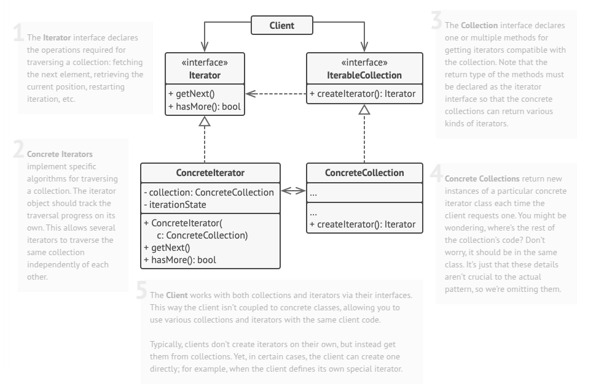

# Iterator
Iterator is a behavioral design pattern that lets you traverse elements of a collection without exposing its underlying representation (list, stack, tree, etc.).

## Problem
We want to navigate a specialized collection that manages access to Facebook’s social graph. This collection offers multiple iterators for traversing profiles in distinct ways, such as a ‘friends’ iterator that retrieves a given profile’s friends and a ‘colleagues’ iterator that filters out those who do not work at the same company. Both iterators adhere to a shared interface, enabling clients to access profiles without worrying about authentication or API interactions. Because the client code interacts with collections and iterators solely through interfaces, it remains decoupled from concrete implementations. If a new social network needs integration, developers can introduce new collection and iterator classes without modifying the existing system, ensuring flexibility and maintainability.

## Solution
The ‘friends’ iterator can be used to go over the friends of a given profile. The ‘colleagues’ iterator does the same, except it omits friends who don’t work at the same company as a target person. Both iterators implement a common interface which allows clients to fetch profiles without diving into implementation details such as authentication and sending REST requests.

The client code isn’t coupled to concrete classes because it works with collections and iterators only through interfaces. If you decide to connect your app to a new social network, you simply need to provide new collection and iterator classes without changing the existing code.

## Applicability
- Use the Iterator pattern when your collection has a complex data structure under the hood, but you want to hide its complexity from clients (either for convenience or security reasons).
-  Use the pattern to reduce duplication of the traversal code across your app.
-  Use the Iterator when you want your code to be able to traverse different data structures or when types of these structures are unknown beforehand.

## How To Implement
1. Declare the behavioral.iterator interface. At the very least, it must have a method for fetching the next element from a collection. But for the sake of convenience you can add a couple of other methods, such as fetching the previous element, tracking the current position, and checking the end of the iteration.

2. Declare the collection interface and describe a method for fetching iterators. The return type should be equal to that of the behavioral.iterator interface. You may declare similar methods if you plan to have several distinct groups of iterators.

3. Implement concrete behavioral.iterator classes for the collections that you want to be traversable with iterators. An behavioral.iterator object must be linked with a single collection instance. Usually, this link is established via the behavioral.iterator’s constructor.

4. Implement the collection interface in your collection classes. The main idea is to provide the client with a shortcut for creating iterators, tailored for a particular collection class. The collection object must pass itself to the behavioral.iterator’s constructor to establish a link between them.

5. Go over the client code to replace all of the collection traversal code with the use of iterators. The client fetches a new behavioral.iterator object each time it needs to iterate over the collection elements.