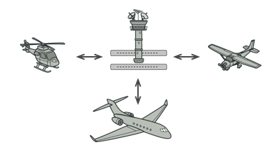

# Mediator
Mediator is a behavioral design pattern that lets you reduce chaotic dependencies between objects. The pattern restricts direct communications between the objects and forces them to collaborate only via a mediator object.

## Problem
Say you have a dialog for creating and editing customer profiles. It consists of various form controls such as text fields, checkboxes, buttons, etc.

Some of the form elements may interact with others. For instance, selecting the “I have a dog” checkbox may reveal a hidden text field for entering the dog’s name. Another example is the submit button that has to validate values of all fields before saving the data.

By having this logic implemented directly inside the code of the form elements you make these elements’ classes much harder to reuse in other forms of the app. For example, you won’t be able to use that checkbox class inside another form, because it’s coupled to the dog’s text field. You can use either all the classes involved in rendering the profile form, or none at all.

## Solution
The Mediator pattern promotes loose coupling by eliminating direct communication between components, instead routing interactions through a mediator object. This approach allows components to remain independent, relying only on a single mediator class rather than multiple interconnected dependencies. In the case of a profile editing form, the dialog class itself can serve as the mediator, managing its sub-elements without introducing unnecessary dependencies.

A key improvement is seen in elements like the submit button. Previously, clicking it triggered validation for all form fields directly. With the mediator, the button simply notifies the dialog, which then performs validation or delegates the task to the appropriate elements. This reduces dependencies and simplifies the button’s role. By further abstracting dialogs through a shared interface, form elements can notify any compatible dialog about events, enhancing flexibility. Ultimately, the Mediator pattern encapsulates complex relationships within a single object, making code easier to maintain, modify, and reuse.

## Real-World Analogy
Pilots of aircraft that approach or depart the airport control area don’t communicate directly with each other. Instead, they speak to an air traffic controller, who sits in a tall tower somewhere near the airstrip. Without the air traffic controller, pilots would need to be aware of every plane in the vicinity of the airport, discussing landing priorities with a committee of dozens of other pilots. That would probably skyrocket the airplane crash statistics.

The tower doesn’t need to control the whole flight. It exists only to enforce constraints in the terminal area because the number of involved actors there might be overwhelming to a pilot.

## Applicability
- Use the Mediator pattern when it’s hard to change some of the classes because they are tightly coupled to a bunch of other classes.
- Use the pattern when you can’t reuse a component in a different program because it’s too dependent on other components.
- Use the Mediator when you find yourself creating tons of component subclasses just to reuse some basic behavior in various contexts.

## How To Implement
1. Identify a group of tightly coupled classes which would benefit from being more independent (e.g., for easier maintenance or simpler reuse of these classes).

2. Declare the behavioral.mediator interface and describe the desired communication protocol between mediators and various components. In most cases, a single method for receiving notifications from components is sufficient.

3. This interface is crucial when you want to reuse component classes in different contexts. As long as the component works with its behavioral.mediator via the generic interface, you can link the component with a different implementation of the behavioral.mediator.

4. Implement the concrete behavioral.mediator class. Consider storing references to all components inside the behavioral.mediator. This way, you could call any component from the behavioral.mediator’s methods.

5. You can go even further and make the behavioral.mediator responsible for the creation and destruction of component objects. After this, the behavioral.mediator may resemble a factory or a facade.

6. Components should store a reference to the behavioral.mediator object. The connection is usually established in the component’s constructor, where a behavioral.mediator object is passed as an argument.

7. Change the components’ code so that they call the behavioral.mediator’s notification method instead of methods on other components. Extract the code that involves calling other components into the behavioral.mediator class. Execute this code whenever the behavioral.mediator receives notifications from that component.