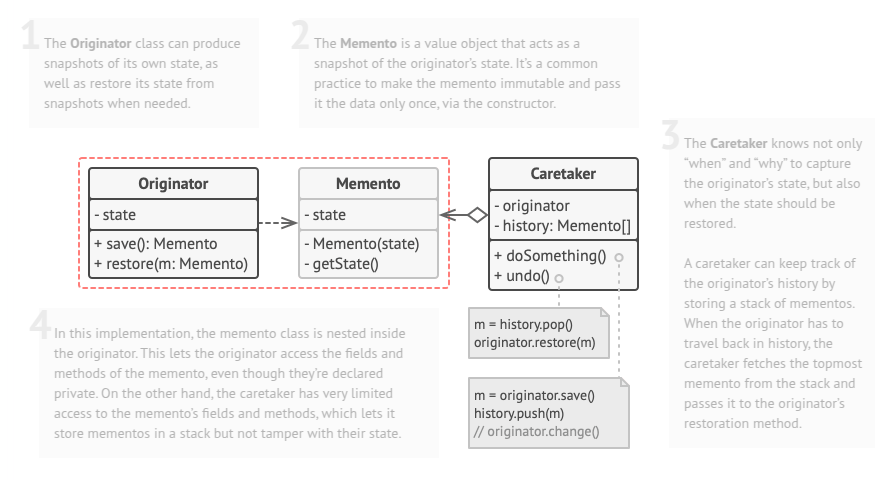

# Memento
Memento is a behavioral design pattern that lets you save and restore the previous state of an object without revealing the details of its implementation.

## Problem
Imagine that you’re creating a text editor app. In addition to simple text editing, your editor can format text, insert inline images, etc.

At some point, you decided to let users undo any operations carried out on the text. This feature has become so common over the years that nowadays people expect every app to have it. For the implementation, you chose to take the direct approach. Before performing any operation, the app records the state of all objects and saves it in some storage. Later, when a user decides to revert an action, the app fetches the latest snapshot from the history and uses it to restore the state of all objects.

## Solution
The Memento pattern resolves this by ensuring state snapshots are created by the state’s owner—the originator object. Instead of external components copying the editor’s state, the editor itself generates snapshots, leveraging full access to its own data.

These snapshots are stored in specialized objects called mementos, which encapsulate the state and restrict access. Only the originator can retrieve the stored state, while other components interact with mementos through a limited interface, allowing access to metadata like creation time or operation history but not the internal state itself. This separation enables mementos to be managed by caretaker objects, which maintain them without modifying their contents.

In a text editor, a dedicated history class can act as a caretaker, maintaining a stack of mementos that records each operation. This stack can even be visualized within the UI, showing users their action history. When an undo action is triggered, the history retrieves the latest memento and passes it to the editor for a rollback. Since the editor has unrestricted access to its mementos, it can restore its previous state seamlessly, ensuring efficient version control.

## Applicability
- Use the Memento pattern when you want to produce snapshots of the object’s behavioral.state to be able to restore a previous behavioral.state of the object.
- Use the pattern when direct access to the object’s fields/getters/setters violates its encapsulation.

## How To Implement
1. Determine what class will play the role of the originator. It’s important to know whether the program uses one central object of this type or multiple smaller ones.

2. Create the behavioral.memento class. One by one, declare a set of fields that mirror the fields declared inside the originator class.

3. Make the behavioral.memento class immutable. A behavioral.memento should accept the data just once, via the constructor. The class should have no setters.

4. If your programming language supports nested classes, nest the behavioral.memento inside the originator. If not, extract a blank interface from the behavioral.memento class and make all other objects use it to refer to the behavioral.memento. You may add some metadata operations to the interface, but nothing that exposes the originator’s behavioral.state.

5. Add a method for producing mementos to the originator class. The originator should pass its behavioral.state to the behavioral.memento via one or multiple arguments of the behavioral.memento’s constructor.

6. The return type of the method should be of the interface you extracted in the previous step (assuming that you extracted it at all). Under the hood, the behavioral.memento-producing method should work directly with the behavioral.memento class.

7. Add a method for restoring the originator’s behavioral.state to its class. It should accept a behavioral.memento object as an argument. If you extracted an interface in the previous step, make it the type of the parameter. In this case, you need to typecast the incoming object to the behavioral.memento class, since the originator needs full access to that object.

8. The caretaker, whether it represents a behavioral.command object, a history, or something entirely different, should know when to request new mementos from the originator, how to store them and when to restore the originator with a particular behavioral.memento.

9. The link between caretakers and originators may be moved into the behavioral.memento class. In this case, each behavioral.memento must be connected to the originator that had created it. The restoration method would also move to the behavioral.memento class. However, this would all make sense only if the behavioral.memento class is nested into originator or the originator class provides sufficient setters for overriding its behavioral.state.

