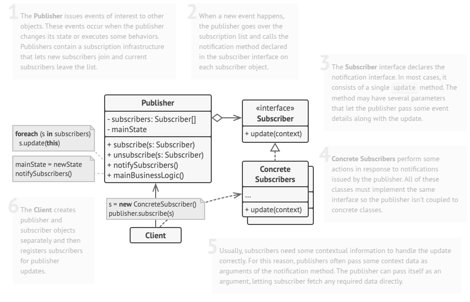

# Observer
Observer is a behavioral design pattern that lets you define a subscription mechanism to notify multiple objects about any events that happen to the object they’re observing.

## Problem
Imagine that you have two types of objects: a Customer and a Store. The customer is very interested in a particular brand of product (say, it’s a new model of the iPhone) which should become available in the store very soon.

The customer could visit the store every day and check product availability. But while the product is still en route, most of these trips would be pointless.

On the other hand, the store could send tons of emails (which might be considered spam) to all customers each time a new product becomes available. This would save some customers from endless trips to the store. At the same time, it’d upset other customers who aren’t interested in new products.

It looks like we’ve got a conflict. Either the customer wastes time checking product availability or the store wastes resources notifying the wrong customers.

## Solution
The object that has some interesting state is often called subject, but since it’s also going to notify other objects about the changes to its state, we’ll call it publisher. All other objects that want to track changes to the publisher’s state are called subscribers.

The Observer pattern suggests that you add a subscription mechanism to the publisher class so individual objects can subscribe to or unsubscribe from a stream of events coming from that publisher. Fear not! Everything isn’t as complicated as it sounds. In reality, this mechanism consists of 1) an array field for storing a list of references to subscriber objects and 2) several public methods which allow adding subscribers to and removing them from that list.

## Applicability
- Use the Observer pattern when changes to the behavioral.state of one object may require changing other objects, and the actual set of objects is unknown beforehand or changes dynamically.
- Use the pattern when some objects in your app must observe others, but only for a limited time or in specific cases.

## How To Implement
1. Look over your business logic and try to break it down into two parts: the core functionality, independent of other code, will act as the publisher; the rest will turn into a set of subscriber classes.

2. Declare the subscriber interface. At a bare minimum, it should declare a single update method.

3. Declare the publisher interface and describe a pair of methods for adding a subscriber object to and removing it from the list. Remember that publishers must work with subscribers only via the subscriber interface.

4. Decide where to put the actual subscription list and the implementation of subscription methods. Usually, this code looks the same for all types of publishers, so the obvious place to put it is in an abstract class derived directly from the publisher interface. Concrete publishers extend that class, inheriting the subscription behavior.

5. However, if you’re applying the pattern to an existing class hierarchy, consider an approach based on composition: put the subscription logic into a separate object, and make all real publishers use it.

6. Create concrete publisher classes. Each time something important happens inside a publisher, it must notify all its subscribers.

7. Implement the update notification methods in concrete subscriber classes. Most subscribers would need some context data about the event. It can be passed as an argument of the notification method.

8. But there’s another option. Upon receiving a notification, the subscriber can fetch any data directly from the notification. In this case, the publisher must pass itself via the update method. The less flexible option is to link a publisher to the subscriber permanently via the constructor.

9. The client must create all necessary subscribers and register them with proper publishers.