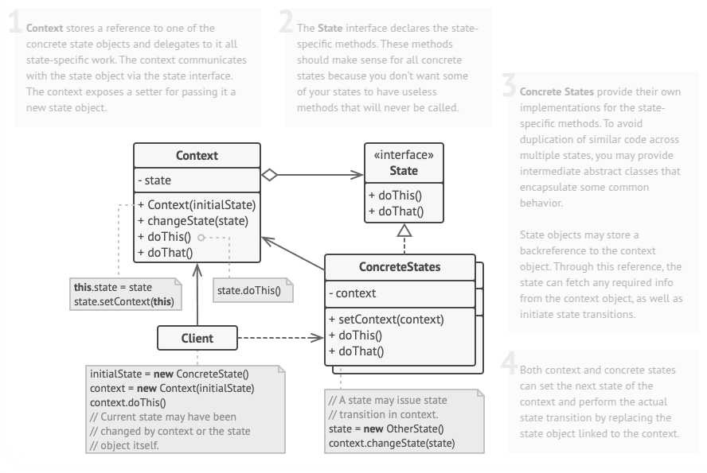

# State
State is a behavioral design pattern that lets an object alter its behavior when its internal state changes. It appears as if the object changed its class.

## Problem
Imagine that we have a Document class. A document can be in one of three states: Draft, Moderation and Published. The publish method of the document works a little bit differently in each state:

* In Draft, it moves the document to moderation.
* In Moderation, it makes the document public, but only if the current user is an administrator.
* In Published, it doesn’t do anything at all.

## Solution
he State pattern suggests that you create new classes for all possible states of an object and extract all state-specific behaviors into these classes.

Instead of implementing all behaviors on its own, the original object, called context, stores a reference to one of the state objects that represents its current state, and delegates all the state-related work to that object.

To transition the context into another state, replace the active state object with another object that represents that new state. This is possible only if all state classes follow the same interface and the context itself works with these objects through that interface.

This structure may look similar to the Strategy pattern, but there’s one key difference. In the State pattern, the particular states may be aware of each other and initiate transitions from one state to another, whereas strategies almost never know about each other.

## Applicability
- Use the State pattern when you have an object that behaves differently depending on its current behavioral.state, the number of states is enormous, and the behavioral.state-specific code changes frequently.
- Use the pattern when you have a class polluted with massive conditionals that alter how the class behaves according to the current values of the class’s fields.
- Use State when you have a lot of duplicate code across similar states and transitions of a condition-based behavioral.state machine.

## How To Implement
1. Decide what class will act as the context. It could be an existing class which already has the behavioral.state-dependent code; or a new class, if the behavioral.state-specific code is distributed across multiple classes.

2. Declare the behavioral.state interface. Although it may mirror all the methods declared in the context, aim only for those that may contain behavioral.state-specific behavior.

3. For every actual behavioral.state, create a class that derives from the behavioral.state interface. Then go over the methods of the context and extract all code related to that behavioral.state into your newly created class.

4. While moving the code to the behavioral.state class, you might discover that it depends on private members of the context. There are several workarounds:

5. Make these fields or methods public. 
   * Turn the behavior you’re extracting into a public method in the context and call it from the behavioral.state class. This way is ugly but quick, and you can always fix it later. 
   * Nest the behavioral.state classes into the context class, but only if your programming language supports nesting classes. 
   * In the context class, add a reference field of the behavioral.state interface type and a public setter that allows overriding the value of that field.

6. Go over the method of the context again and replace empty behavioral.state conditionals with calls to corresponding methods of the behavioral.state object.

7. To switch the behavioral.state of the context, create an instance of one of the behavioral.state classes and pass it to the context. You can do this within the context itself, or in various states, or in the client. Wherever this is done, the class becomes dependent on the concrete behavioral.state class that it instantiates.