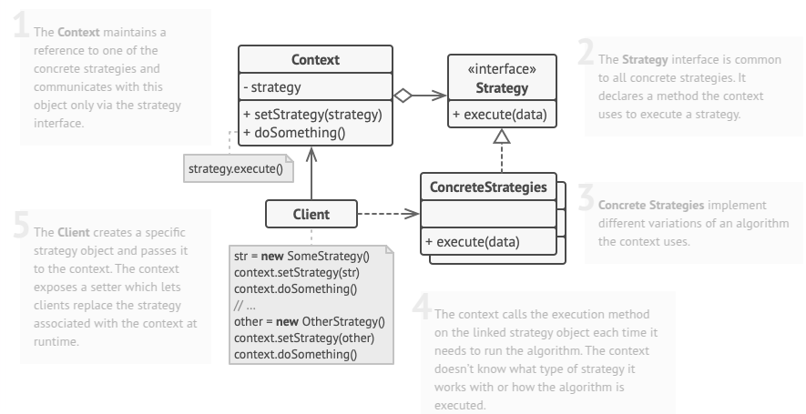

# Strategy
Strategy is a behavioral design pattern that lets you define a family of algorithms, put each of them into a separate class, and make their objects interchangeable.

## Problem
One of the most requested features for the app was automatic route planning. A user should be able to enter an address and see the fastest route to that destination displayed on the map.

The first version of the app could only build the routes over roads. People who traveled by car were bursting with joy. But apparently, not everybody likes to drive on their vacation. So with the next update, you added an option to build walking routes. Right after that, you added another option to let people use public transport in their routes.

However, that was only the beginning. Later you planned to add route building for cyclists. And even later, another option for building routes through all of a city’s tourist attractions.

## Solution
The context class maintains a reference to a strategy object and delegates execution to it rather than handling tasks internally. Instead of selecting an algorithm, the context receives the desired strategy from the client and interacts with all strategies via a shared interface, which provides a single method for initiating the encapsulated logic. This abstraction keeps the context independent of specific strategies, allowing new algorithms to be added or modified without altering the context or existing strategies.

In a navigation app, different routing algorithms can be defined in separate classes, each implementing a buildRoute method that calculates checkpoints between an origin and destination. Despite variations in routing logic, the navigator class focuses solely on rendering the route, remaining agnostic to the chosen algorithm. A method for switching routing strategies enables UI elements, such as toolbar buttons, to adjust the active strategy dynamically, ensuring flexibility and maintainability.

## Applicability
- Use the Strategy pattern when you want to use different variants of an algorithm within an object and be able to switch from one algorithm to another during runtime.
- Use the Strategy when you have a lot of similar classes that only differ in the way they execute some behavior.
- Use the pattern to isolate the business logic of a class from the implementation details of algorithms that may not be as important in the context of that logic.
- Use the pattern when your class has a massive conditional statement that switches between different variants of the same algorithm.

## How To Implement
1. In the context class, identify an algorithm that’s prone to frequent changes. It may also be a massive conditional that selects and executes a variant of the same algorithm at runtime.

2. Declare the behavioral.strategy interface common to all variants of the algorithm.

3. One by one, extract all algorithms into their own classes. They should all implement the behavioral.strategy interface.

4. In the context class, add a field for storing a reference to a behavioral.strategy object. Provide a setter for replacing values of that field. The context should work with the behavioral.strategy object only via the behavioral.strategy interface. The context may define an interface which lets the behavioral.strategy access its data.

5. Clients of the context must associate it with a suitable behavioral.strategy that matches the way they expect the context to perform its primary job.

> **Difference between Strategy and Template design pattern:**
> The Strategy pattern helps pick the best approach for a task at runtime by swapping different options without changing the main system. The Template Method pattern, on the other hand, sets up a fixed process with steps that can be adjusted in subclasses but follows the same structure every time. Strategy is useful when different methods need to be chosen on the fly, while Template Method works well when a process remains consistent but needs small variations.