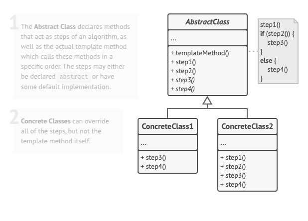

# Template Method
Template Method is a behavioral design pattern that defines the skeleton of an algorithm in the superclass but lets subclasses override specific steps of the algorithm without changing its structure.

## Problem
Imagine that you’re creating a data mining application that analyzes corporate documents. Users feed the app documents in various formats (PDF, DOC, CSV), and it tries to extract meaningful data from these docs in a uniform format.

The first version of the app could work only with DOC files. In the following version, it was able to support CSV files. A month later, you “taught” it to extract data from PDF files.

## Solution
The Template Method pattern structures an algorithm by breaking it into distinct steps, which are turned into methods and organized within a single template method. Some steps are abstract, requiring subclass implementations, while others provide default behavior that can be optionally overridden. The client defines a subclass, implementing mandatory steps and modifying optional ones as needed, without altering the template method itself.

In a data mining application, a base class can define the sequence of document-processing operations while leaving format-specific steps, such as file handling and data extraction, to subclasses. Shared logic, like data analysis and report generation, can be centralized in the base class to eliminate redundancy. The pattern distinguishes abstract steps, which all subclasses must implement, from optional steps with predefined behaviors. Additionally, hooks—empty methods—allow customization at key points without requiring modification, offering flexibility in extending the algorithm while preserving its structure.

## Applicability
- Use the Template Method pattern when you want to let clients extend only particular steps of an algorithm, but not the whole algorithm or its structure.
- Use the pattern when you have several classes that contain almost identical algorithms with some minor differences. As a result, you might need to modify all classes when the algorithm changes.

## How To Implement
1. Analyze the target algorithm to see whether you can break it into steps. Consider which steps are common to all subclasses and which ones will always be unique.

2. Create the abstract base class and declare the behavioral.template method and a set of abstract methods representing the algorithm’s steps. Outline the algorithm’s structure in the behavioral.template method by executing corresponding steps. Consider making the behavioral.template method final to prevent subclasses from overriding it.

3. It’s okay if all the steps end up being abstract. However, some steps might benefit from having a default implementation. Subclasses don’t have to implement those methods.

4. Think of adding hooks between the crucial steps of the algorithm.

5. For each variation of the algorithm, create a new concrete subclass. It must implement all of the abstract steps, but may also override some of the optional ones.

> **Difference between Strategy and Template design pattern:**
> The Strategy pattern helps pick the best approach for a task at runtime by swapping different options without changing the main system. The Template Method pattern, on the other hand, sets up a fixed process with steps that can be adjusted in subclasses but follows the same structure every time. Strategy is useful when different methods need to be chosen on the fly, while Template Method works well when a process remains consistent but needs small variations.
