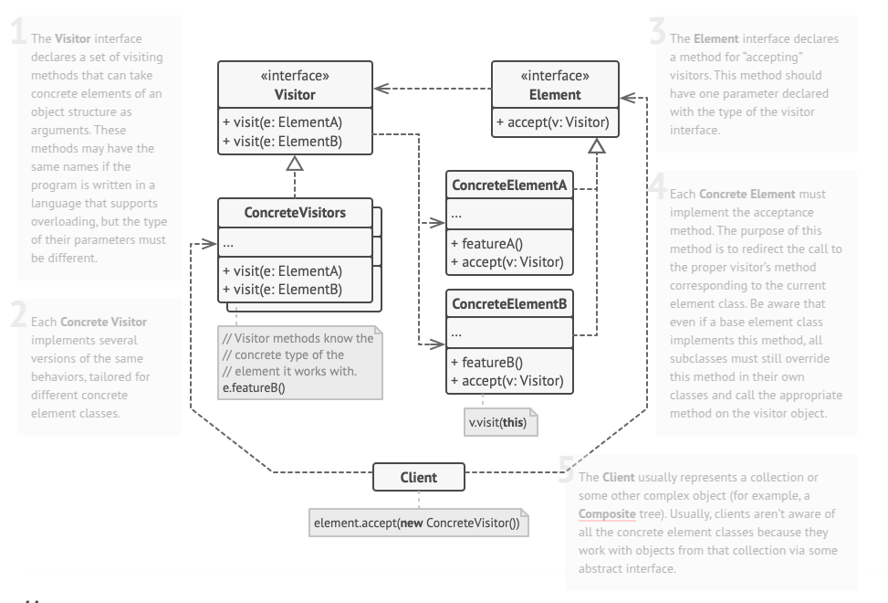

# Visitor
Visitor is a behavioral design pattern that lets you separate algorithms from the objects on which they operate.

## Problem
Imagine that your team develops an app which works with geographic information structured as one colossal graph. Each node of the graph may represent a complex entity such as a city, but also more granular things like industries, sightseeing areas, etc. The nodes are connected with others if there’s a road between the real objects that they represent. Under the hood, each node type is represented by its own class, while each specific node is an object.

At some point, you got a task to implement exporting the graph into XML format. At first, the job seemed pretty straightforward. You planned to add an export method to each node class and then leverage recursion to go over each node of the graph, executing the export method. The solution was simple and elegant: thanks to polymorphism, you weren’t coupling the code which called the export method to concrete classes of nodes.

Unfortunately, the system architect refused to allow you to alter existing node classes. He said that the code was already in production and he didn’t want to risk breaking it because of a potential bug in your changes.

Besides, he questioned whether it makes sense to have the XML export code within the node classes. The primary job of these classes was to work with geodata. The XML export behavior would look alien there.

There was another reason for the refusal. It was highly likely that after this feature was implemented, someone from the marketing department would ask you to provide the ability to export into a different format, or request some other weird stuff. This would force you to change those precious and fragile classes again.

## Solution
The Visitor pattern streamlines code by moving new behaviors into a separate visitor class rather than embedding them within existing objects. Instead of handling the behavior directly, an object is passed to a visitor method, granting the visitor access to the relevant data within that object. This approach simplifies extending functionality while keeping the original classes unchanged.

When applying behavior across different object types—such as XML export—the visitor class defines multiple methods tailored to various node classes. However, since method signatures differ, traditional polymorphism cannot resolve method selection dynamically. Method overloading isn’t a reliable alternative either, as it fails when the exact object type is unknown at runtime. The Visitor pattern solves this issue using Double Dispatch, allowing objects to determine the correct visitor method by "accepting" the visitor and guiding method execution accordingly. By introducing a common interface for visitors, all nodes can interact with any visitor implementation seamlessly, making it easy to add new behaviors without modifying existing code.

## Applicability
- Use the Visitor when you need to perform an operation on all elements of a complex object structure (for example, an object tree).
- Use the Visitor to clean up the business logic of auxiliary behaviors.
- Use the pattern when a behavior makes sense only in some classes of a class hierarchy, but not in others.

## How To Implement
1. Declare the behavioral.visitor interface with a set of “visiting” methods, one per each concrete element class that exists in the program.

2. Declare the element interface. If you’re working with an existing element class hierarchy, add the abstract “acceptance” method to the base class of the hierarchy. This method should accept a behavioral.visitor object as an argument.

3. Implement the acceptance methods in all concrete element classes. These methods must simply redirect the call to a visiting method on the incoming behavioral.visitor object which matches the class of the current element.

4. The element classes should only work with visitors via the behavioral.visitor interface. Visitors, however, must be aware of all concrete element classes, referenced as parameter types of the visiting methods.

5. For each behavior that can’t be implemented inside the element hierarchy, create a new concrete behavioral.visitor class and implement all of the visiting methods.

6. You might encounter a situation where the behavioral.visitor will need access to some private members of the element class. In this case, you can either make these fields or methods public, violating the element’s encapsulation, or nest the behavioral.visitor class in the element class. The latter is only possible if you’re lucky to work with a programming language that supports nested classes.

7. The client must create behavioral.visitor objects and pass them into elements via “acceptance” methods.