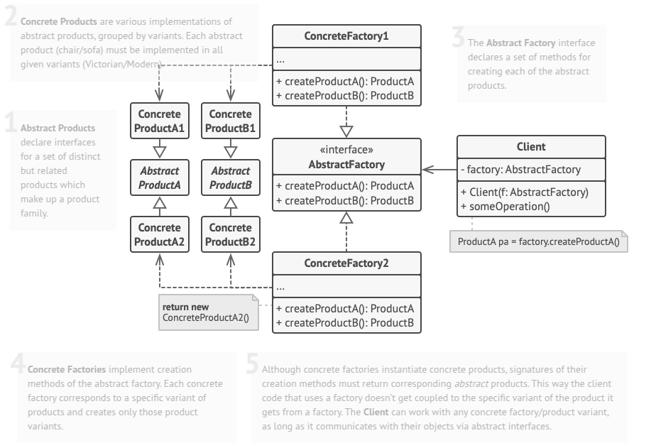
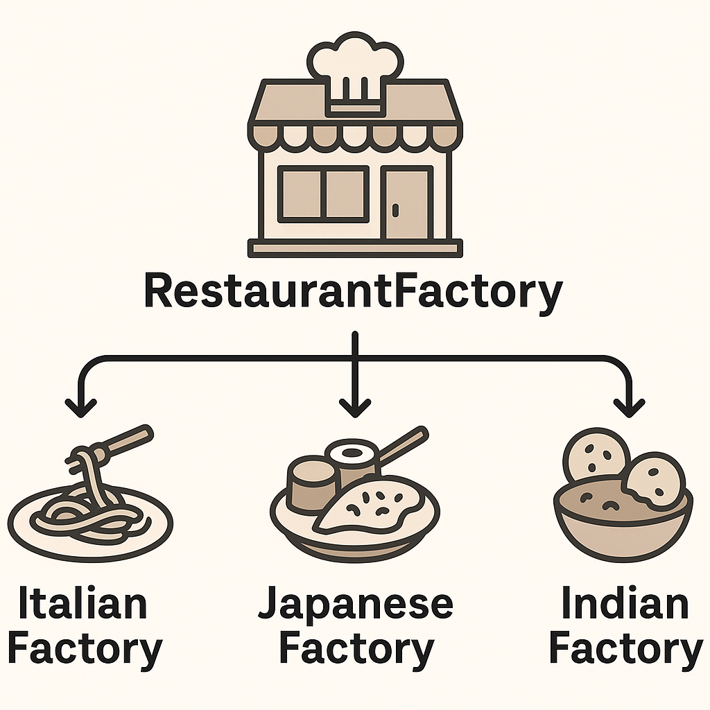

# Abstract Factory
Abstract Factory is a creational design pattern that lets you produce families of related objects without specifying their concrete classes.

## Problem
Imagine that you’re creating a furniture shop simulator. Your code consists of classes that represent:

1. A family of related products, say: Chair + Sofa + CoffeeTable.

2. Several variants of this family. For example, products Chair + Sofa + CoffeeTable are available in these variants: Modern, Victorian, ArtDeco.

You need a way to create individual furniture objects so that they match other objects of the same family. Customers get quite mad when they receive non-matching furniture.

Also, you don’t want to change existing code when adding new products or families of products to the program. Furniture vendors update their catalogs very often, and you wouldn’t want to change the core code each time it happens.

## Solution
The Abstract Factory pattern establishes clear interfaces for each distinct product within a product family, such as chairs, sofas, and coffee tables. By ensuring all product variants adhere to these interfaces, developers can create interchangeable objects without modifying the client code. The pattern introduces an Abstract Factory, an interface containing methods for creating different product types—such as `createChair`, `createSofa`, and `createCoffeeTable`—which return abstract products based on these predefined interfaces.

For every product family variant, a separate factory class implements the Abstract Factory interface, ensuring consistency across related objects. For example, a `ModernFurnitureFactory` exclusively produces `ModernChair`, `ModernSofa`, and `ModernCoffeeTable`. The client code interacts with factories and products only through their abstract interfaces, making it possible to switch factories or product variants dynamically. At the application's initialization stage, a concrete factory object is created based on configurations or environment settings, ensuring flexibility in selecting different styles or types while maintaining uniform behavior across all related products.

## Real World Analogy
Think of the Abstract Factory pattern like a restaurant franchise.

Imagine you have a global restaurant chain, and each location serves cuisine based on its region—Italian in Rome, Japanese in Tokyo, Indian in Bengaluru. Despite these differences, every franchise maintains a consistent process: they use specific chefs, kitchen equipment, and recipes suited to their regional cuisine.

Now, instead of creating a specific restaurant directly, you have a RestaurantFactory that produces different types of CuisineFactory (ItalianFactory, JapaneseFactory, IndianFactory). Each of these cuisine factories knows how to create dishes, hire chefs, and set up kitchens suited to its respective style.

When a new restaurant opens, it doesn't need to worry about the details—it simply requests the right CuisineFactory, and everything (chefs, dishes, kitchen setups) is generated accordingly.

This ensures consistency while allowing for flexibility in different regions. Similarly, in software design, the Abstract Factory pattern helps create families of related objects without specifying their exact classes, ensuring modular and scalable code.

## Applicability
- Use the Abstract Factory when your code needs to work with various families of related products, but you don’t want it to depend on the concrete classes of those products—they might be unknown beforehand or you simply want to allow for future extensibility.
- Consider implementing the Abstract Factory when you have a class with a set of Factory Methods that blur its primary responsibility.

## How To Implement
1. Map out a matrix of distinct product types versus variants of these products.

2. Declare abstract product interfaces for all product types. Then make all concrete product classes implement these interfaces.

3. Declare the abstract factory interface with a set of creation methods for all abstract products.

4. Implement a set of concrete factory classes, one for each product variant.

5. Create factory initialization code somewhere in the app. It should instantiate one of the concrete factory classes, depending on the application configuration or the current environment. Pass this factory object to all classes that construct products.

6. Scan through the code and find all direct calls to product constructors. Replace them with calls to the appropriate creation method on the factory object.

