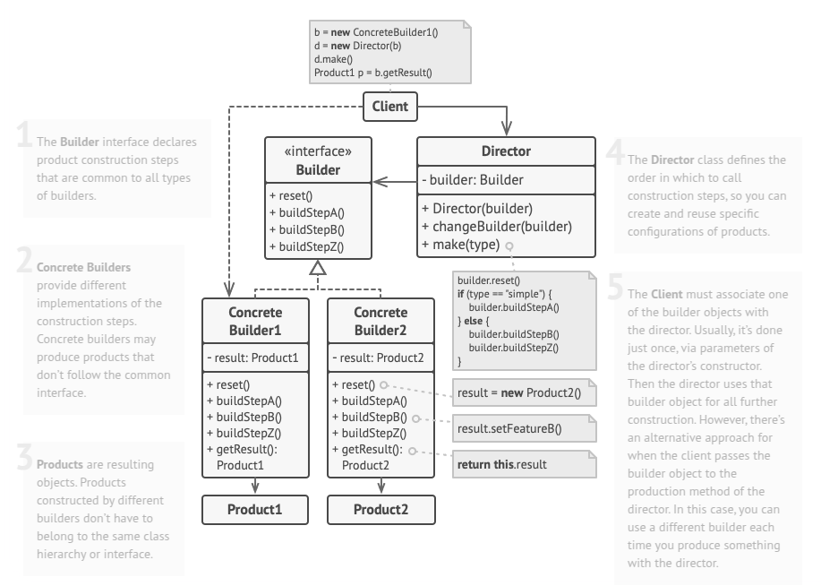
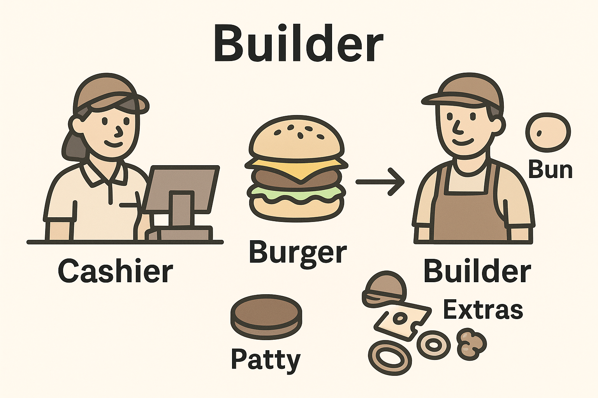

# Builder
Builder is a creational design pattern that lets you construct complex objects step by step. The pattern allows you to produce different types and representations of an object using the same construction code.

## Problem
Imagine a complex object that requires laborious, step-by-step initialization of many fields and nested objects. Such initialization code is usually buried inside a monstrous constructor with lots of parameters. Or even worse: scattered all over the client code.

For example, let’s think about how to create a House object. To build a simple house, you need to construct four walls and a floor, install a door, fit a pair of windows, and build a roof. But what if you want a bigger, brighter house, with a backyard and other goodies (like a heating system, plumbing, and electrical wiring)?

The simplest solution is to extend the base House class and create a set of subclasses to cover all combinations of the parameters. But eventually you’ll end up with a considerable number of subclasses. Any new parameter, such as the porch style, will require growing this hierarchy even more.

There’s another approach that doesn’t involve breeding subclasses. You can create a giant constructor right in the base House class with all possible parameters that control the house object. While this approach indeed eliminates the need for subclasses, it creates another problem.

In most cases most of the parameters will be unused, making the constructor calls pretty ugly. For instance, only a fraction of houses have swimming pools, so the parameters related to swimming pools will be useless nine times out of ten.

## Solution
The Builder pattern helps decouple object creation from its class by moving construction logic into separate builder objects. Instead of defining object creation within a class, it breaks the process into distinct steps (e.g., buildWalls, buildDoor), allowing flexibility in object configuration. Not all steps need to be executed—only the ones necessary for a specific variation of the product.

To support different representations of the same object, multiple builder classes can implement the same construction steps but in different ways. For instance, a wooden cabin builder constructs walls from wood, while a castle builder uses stone. By following the same sequence of steps, different builders can produce varied outputs—whether a regular house made of wood and glass, a castle of stone and iron, or a palace built from gold and diamonds. This approach ensures consistency while allowing diverse implementations through a shared interface.

## Real World Analogy

**"Ordering a Custom Burger at a Restaurant"**

You walk into a burger restaurant that allows **customized orders**. There's a staff member (the **Builder**) who takes your instructions and builds the burger step-by-step:

* You choose the **bun**: sesame, whole wheat, or lettuce wrap.
* You pick the **patty**: beef, chicken, veggie.
* Then the **extras**: cheese, onions, pickles, sauces, etc.

Once you're done selecting, the **builder assembles** your burger in the specific order you requested.

The **cashier (Director)** coordinates the process and ensures the builder makes the burger according to the selected configuration.

### **Mapping to the Pattern:**

| Concept              | Real-World Analogy                                   |
| -------------------- | ---------------------------------------------------- |
| **Builder**          | Burger staff who assembles the burger                |
| **Director**         | Cashier or Order Manager                             |
| **Product**          | Final burger                                         |
| **Concrete Builder** | A specific staff member (e.g., "Veg Burger Builder") |
| **Client**           | You, the customer giving the instructions            |

* You don’t need to know how the burger is assembled internally (separation of construction and representation).
* You can get different variations (cheeseburger, vegan burger, double patty burger) **from the same process**.
* New types of burgers can be added without changing how the order system (Director) works.

## Applicability
- Use the Builder pattern to get rid of a “telescoping constructor”.
- Use the Builder pattern when you want your code to be able to create different representations of some product (for example, stone and wooden houses).
- Use the Builder to construct Composite trees or other complex objects.

## How To Implement
1. Make sure that you can clearly define the common construction steps for building all available product representations. Otherwise, you won’t be able to proceed with implementing the pattern.

2. Declare these steps in the base builder interface.

3. Create a concrete builder class for each of the product representations and implement their construction steps.

4. Don’t forget about implementing a method for fetching the result of the construction. The reason why this method can’t be declared inside the builder interface is that various builders may construct products that don’t have a common interface. Therefore, you don’t know what would be the return type for such a method. However, if you’re dealing with products from a single hierarchy, the fetching method can be safely added to the base interface.

5. Think about creating a director class. It may encapsulate various ways to construct a product using the same builder object.

6. The client code creates both the builder and the director objects. Before construction starts, the client must pass a builder object to the director. Usually, the client does this only once, via parameters of the director’s class constructor. The director uses the builder object in all further construction. There’s an alternative approach, where the builder is passed to a specific product construction method of the director.

7. The construction result can be obtained directly from the director only if all products follow the same interface. Otherwise, the client should fetch the result from the builder.
