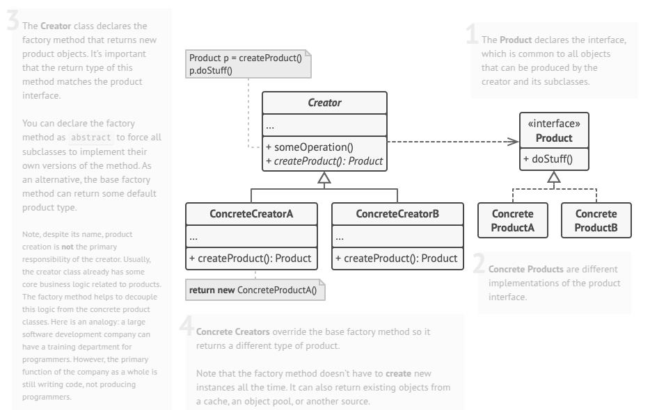

# Factory Method
Factory Method is a creational design pattern that provides an interface for creating objects in a superclass, but allows subclasses to alter the type of objects that will be created.

## Problem
Imagine that you’re creating a logistics management application. The first version of your app can only handle transportation by trucks, so the bulk of your code lives inside the Truck class.

After a while, your app becomes pretty popular. Each day you receive dozens of requests from sea transportation companies to incorporate sea logistics into the app.

Great news, right? But how about the code? At present, most of your code is coupled to the Truck class. Adding Ships into the app would require making changes to the entire codebase. Moreover, if later you decide to add another type of transportation to the app, you will probably need to make all of these changes again.

As a result, you will end up with pretty nasty code, riddled with conditionals that switch the app’s behavior depending on the class of transportation objects.

## Solution
The Factory Method pattern replaces direct object instantiation with a dedicated factory method, ensuring flexibility and customization through subclassing. While objects are still created using the `new` operator, the factory method encapsulates this process, allowing subclasses to override it and generate specific types of products. However, these products must share a common interface or base class, ensuring consistency in interactions.

For instance, the `Transport` interface can be implemented by both `Truck` and `Ship` classes, each defining a `deliver` method suited to its mode of transport—land or sea. The `RoadLogistics` class returns truck objects, while `SeaLogistics` returns ships. The client code remains unaware of the specific product types, treating all instances as `Transport`, relying only on their shared interface while delegating implementation details to subclasses. This approach promotes scalability and adaptability in object creation.

## Real World Analogy
"Ordering a Ride from a Ride-Sharing App (like Uber/Ola)"

Scenario:
When you open a ride-sharing app and request a ride, you don’t directly create a car or driver. Instead, you select the type of ride (e.g., Economy, Premium, Bike, or SUV), and the app internally decides which specific vehicle and driver to assign based on your choice.

You, as the customer, just specify what kind of ride you need—not how that ride is created or who provides it.

Mapping to Factory Method:
Factory Method Concept	Real-World Analogy
Creator (abstract)	Ride-sharing app interface (e.g., RideService)
Concrete Creator	EconomyRideService, PremiumRideService, etc.
Product (interface)	Ride interface (or Vehicle)
Concrete Products	Bike, Sedan, SUV, Auto
Client	You, the user

Each ride type has its own internal logic to create and assign a suitable vehicle—but this is hidden from the user. The app just exposes a method like bookRide() that internally uses a specific "factory method" to generate the correct ride object.

## Applicability
- Use the Factory Method when you don’t know beforehand the exact types and dependencies of the objects your code should work with.
- Use the Factory Method when you want to provide users of your library or framework with a way to extend its internal components.
- Use the Factory Method when you want to save system resources by reusing existing objects instead of rebuilding them each time.

## How To Implement
1. Make all products follow the same interface. This interface should declare methods that make sense in every product.

2. Add an empty factory method inside the creator class. The return type of the method should match the common product interface.

3. In the creator’s code find all references to product constructors. One by one, replace them with calls to the factory method, while extracting the product creation code into the factory method.

4. You might need to add a temporary parameter to the factory method to control the type of returned product.

5. At this point, the code of the factory method may look pretty ugly. It may have a large switch statement that picks which product class to instantiate. But don’t worry, we’ll fix it soon enough.

Now, create a set of creator subclasses for each type of product listed in the factory method. Override the factory method in the subclasses and extract the appropriate bits of construction code from the base method.

If there are too many product types and it doesn’t make sense to create subclasses for all of them, you can reuse the control parameter from the base class in subclasses.

For instance, imagine that you have the following hierarchy of classes: the base Mail class with a couple of subclasses: AirMail and GroundMail; the Transport classes are Plane, Truck and Train. While the AirMail class only uses Plane objects, GroundMail may work with both Truck and Train objects. You can create a new subclass (say TrainMail) to handle both cases, but there’s another option. The client code can pass an argument to the factory method of the GroundMail class to control which product it wants to receive.

6. If, after all of the extractions, the base factory method has become empty, you can make it abstract. If there’s something left, you can make it a default behavior of the method.
