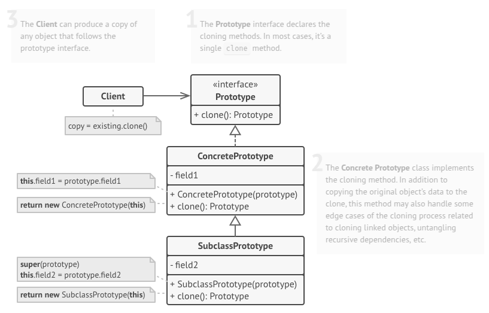

# Prototype
Prototype is a creational design pattern that lets you copy existing objects without making your code dependent on their classes.

## Problem
Say you have an object, and you want to create an exact copy of it. How would you do it? First, you have to create a new object of the same class. Then you have to go through all the fields of the original object and copy their values over to the new object.

Nice! But there’s a catch. Not all objects can be copied that way because some of the object’s fields may be private and not visible from outside of the object itself.

There’s one more problem with the direct approach. Since you have to know the object’s class to create a duplicate, your code becomes dependent on that class. If the extra dependency doesn’t scare you, there’s another catch. Sometimes you only know the interface that the object follows, but not its concrete class, when, for example, a parameter in a method accepts any objects that follow some interface.

## Solution
The Prototype pattern enables objects to create clones of themselves, reducing dependency on direct instantiation. By implementing a common cloning interface, objects can replicate themselves without tightly coupling code to their class definitions. This approach simplifies object creation, especially when dealing with complex configurations.

Instead of constructing a new object from scratch, a prototype object serves as a blueprint. The clone method copies field values, including private attributes, ensuring an identical replica. This technique is useful when dealing with numerous fields or varied configurations, as cloning offers a more efficient alternative to subclassing. With pre-configured prototypes, new instances can be easily generated by duplicating existing ones rather than rebuilding them.

## Real World Analogy
In real life, prototypes are used for performing various tests before starting mass production of a product. However, in this case, prototypes don’t participate in any actual production, playing a passive role instead.

Since industrial prototypes don’t really copy themselves, a much closer analogy to the pattern is the process of mitotic cell division (biology, remember?). After mitotic division, a pair of identical cells is formed. The original cell acts as a prototype and takes an active role in creating the copy.

## Applicability
- Use the Prototype pattern when your code shouldn’t depend on the concrete classes of objects that you need to copy.
- Use the pattern when you want to reduce the number of subclasses that only differ in the way they initialize their respective objects.

## How To Implement
1. Create the prototype interface and declare the clone method in it. Or just add the method to all classes of an existing class hierarchy, if you have one.

2. A prototype class must define the alternative constructor that accepts an object of that class as an argument. The constructor must copy the values of all fields defined in the class from the passed object into the newly created instance. If you’re changing a subclass, you must call the parent constructor to let the superclass handle the cloning of its private fields.

If your programming language doesn’t support method overloading, you won’t be able to create a separate “prototype” constructor. Thus, copying the object’s data into the newly created clone will have to be performed within the clone method. Still, having this code in a regular constructor is safer because the resulting object is returned fully configured right after you call the new operator.

3. The cloning method usually consists of just one line: running a new operator with the prototypical version of the constructor. Note, that every class must explicitly override the cloning method and use its own class name along with the new operator. Otherwise, the cloning method may produce an object of a parent class.

4. Optionally, create a centralized prototype registry to store a catalog of frequently used prototypes.

You can implement the registry as a new factory class or put it in the base prototype class with a static method for fetching the prototype. This method should search for a prototype based on search criteria that the client code passes to the method. The criteria might either be a simple string tag or a complex set of search parameters. After the appropriate prototype is found, the registry should clone it and return the copy to the client.

Finally, replace the direct calls to the subclasses’ constructors with calls to the factory method of the prototype registry.