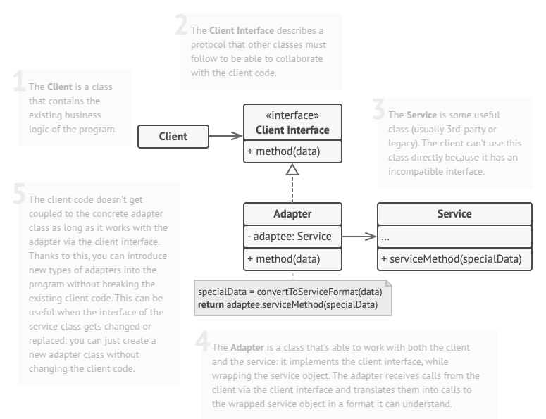

# Adapter
Adapter is a structural design pattern that allows objects with incompatible interfaces to collaborate.

## Problem
Imagine that you’re creating a stock market monitoring app. The app downloads the stock data from multiple sources in XML format and then displays nice-looking charts and diagrams for the user.

At some point, you decide to improve the app by integrating a smart 3rd-party analytics library. But there’s a catch: the analytics library only works with data in JSON format.

You could change the library to work with XML. However, this might break some existing code that relies on the library. And worse, you might not have access to the library’s source code in the first place, making this approach impossible.

## Solution
An adapter is a special object that enables communication between incompatible interfaces by converting one object's format into another's. It wraps an object, hiding the complexity of conversion, so the wrapped object remains unaware of the transformation. For instance, an adapter can take an object using metric units and convert its data into imperial units like feet and miles.

Beyond data conversion, adapters facilitate collaboration between objects with differing interfaces. They work by providing a compatible interface for an existing object, allowing it to call the adapter’s methods. The adapter then forwards the request to the second object, ensuring the format and order align with its expectations. In some cases, two-way adapters can be created to translate calls in both directions, making interactions even more seamless.

## Applicability
- Use the Adapter class when you want to use some existing class, but its interface isn’t compatible with the rest of your code.
- Use the pattern when you want to reuse several existing subclasses that lack some common functionality that can’t be added to the superclass.

## How To Implement
1. Make sure that you have at least two classes with incompatible interfaces:
   * A useful service class, which you can’t change (often 3rd-party, legacy or with lots of existing dependencies). 
   * One or several client classes that would benefit from using the service class.

2. Declare the client interface and describe how clients communicate with the service.

3. Create the adapter class and make it follow the client interface. Leave all the methods empty for now.

4. Add a field to the adapter class to store a reference to the service object. The common practice is to initialize this field via the constructor, but sometimes it’s more convenient to pass it to the adapter when calling its methods.

5. One by one, implement all methods of the client interface in the adapter class. The adapter should delegate most of the real work to the service object, handling only the interface or data format conversion.

6. Clients should use the adapter via the client interface. This will let you change or extend the adapters without affecting the client code.