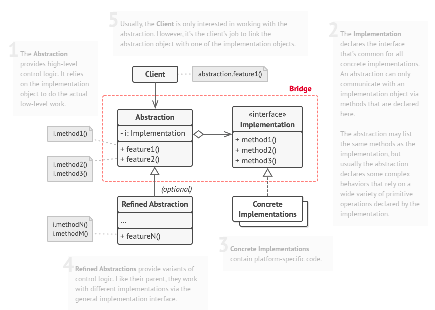
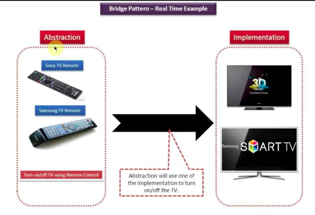

# Bridge
Bridge is a structural design pattern that lets you split a large class or a set of closely related classes into two separate hierarchies—abstraction and implementation—which can be developed independently of each other.

## Problem
Say you have a geometric Shape class with a pair of subclasses: Circle and Square. You want to extend this class hierarchy to incorporate colors, so you plan to create Red and Blue shape subclasses. However, since you already have two subclasses, you’ll need to create four class combinations such as BlueCircle and RedSquare.

Adding new shape types and colors to the hierarchy will grow it exponentially. For example, to add a triangle shape you’d need to introduce two subclasses, one for each color. And after that, adding a new color would require creating three subclasses, one for each shape type. The further we go, the worse it becomes.

## Solution
The issue arises because shape classes are being extended in two independent dimensions: form and color, which can make class inheritance complex. The Bridge pattern addresses this by shifting from inheritance to object composition. Instead of maintaining all state and behaviors within one class, it separates one dimension into its own hierarchy, allowing the original classes to reference objects from the new hierarchy.

Applying this approach, color-related functionality can be extracted into a separate class with subclasses like Red and Blue. The Shape class then holds a reference to a color object, enabling it to delegate color-related tasks. This reference effectively serves as a bridge between Shape and Color, ensuring that adding new colors doesn’t require modifications to the shape hierarchy and vice versa, thus improving flexibility and maintainability.

## Real World Analogy
The Bridge design pattern can be compared to a remote control and a device. Imagine you have different types of remote controls (basic, advanced, voice-controlled) and different types of devices (TV, music system, air conditioner). Instead of creating separate classes for each combination (e.g., BasicRemoteTV, AdvancedRemoteMusicSystem), the Bridge pattern allows you to separate the abstraction (remote control) from the implementation (device). This way, you can mix and match remotes and devices independently.

## Applicability
- Use the Bridge pattern when you want to divide and organize a monolithic class that has several variants of some functionality (for example, if the class can work with various database servers).
- Use the pattern when you need to extend a class in several orthogonal (independent) dimensions.
- Use the Bridge if you need to be able to switch implementations at runtime.

## How To Implement
1. Identify the orthogonal dimensions in your classes. These independent concepts could be: abstraction/platform, domain/infrastructure, front-end/back-end, or interface/implementation.

2. See what operations the client needs and define them in the base abstraction class.

3. Determine the operations available on all platforms. Declare the ones that the abstraction needs in the general implementation interface.

4. For all platforms in your domain create concrete implementation classes, but make sure they all follow the implementation interface.

5. Inside the abstraction class, add a reference field for the implementation type. The abstraction delegates most of the work to the implementation object that’s referenced in that field.

6. If you have several variants of high-level logic, create refined abstractions for each variant by extending the base abstraction class.

7. The client code should pass an implementation object to the abstraction’s constructor to associate one with the other. After that, the client can forget about the implementation and work only with the abstraction object.
