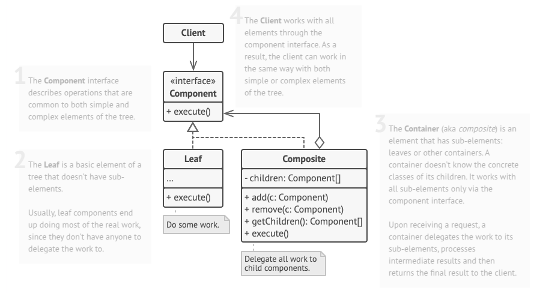
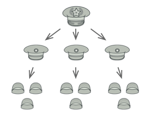

# Composite
Composite is a structural design pattern that lets you compose objects into tree structures and then work with these structures as if they were individual objects.

## Problem
Imagine that you have two types of objects: Products and Boxes. A Box can contain several Products as well as a number of smaller Boxes. These little Boxes can also hold some Products or even smaller Boxes, and so on.

Say you decide to create an ordering system that uses these classes. Orders could contain simple products without any wrapping, as well as boxes stuffed with products...and other boxes. How would you determine the total price of such an order?

You could try the direct approach: unwrap all the boxes, go over all the products and then calculate the total. That would be doable in the real world; but in a program, it’s not as simple as running a loop. You have to know the classes of Products and Boxes you’re going through, the nesting level of the boxes and other nasty details beforehand. All of this makes the direct approach either too awkward or even impossible.

## Solution
The Composite pattern allows Products and Boxes to be handled through a common interface that defines a method for calculating total price. For a product, the method simply returns its price. However, for a box, it iterates through its contents, calculating the price of each item—including smaller boxes, which recursively evaluate their own contents—until all inner components are accounted for. Additionally, a box can include extra costs, such as packaging fees.

The main advantage of this approach is that objects can be treated uniformly, regardless of whether they are individual products or complex nested boxes. The interface abstracts away the differences, enabling seamless interactions without the need to distinguish between concrete classes. When the method is called, objects autonomously propagate the request throughout the structure, simplifying operations and enhancing flexibility.

## Real World Analogy
Armies of most countries are structured as hierarchies. An army consists of several divisions; a division is a set of brigades, and a brigade consists of platoons, which can be broken down into squads. Finally, a squad is a small group of real soldiers. Orders are given at the top of the hierarchy and passed down onto each level until every soldier knows what needs to be done.

## Applicability
- Use the Composite pattern when you have to implement a tree-like object structure.
- Use the pattern when you want the client code to treat both simple and complex elements uniformly.

## How To Implement
1. Make sure that the core model of your app can be represented as a tree structure. Try to break it down into simple elements and containers. Remember that containers must be able to contain both simple elements and other containers.

2. Declare the component interface with a list of methods that make sense for both simple and complex components.

3. Create a leaf class to represent simple elements. A program may have multiple different leaf classes.

4. Create a container class to represent complex elements. In this class, provide an array field for storing references to sub-elements. The array must be able to store both leaves and containers, so make sure it’s declared with the component interface type.

5. While implementing the methods of the component interface, remember that a container is supposed to be delegating most of the work to sub-elements.

6. Finally, define the methods for adding and removal of child elements in the container.

Keep in mind that these operations can be declared in the component interface. This would violate the Interface Segregation Principle because the methods will be empty in the leaf class. However, the client will be able to treat all the elements equally, even when composing the tree.

