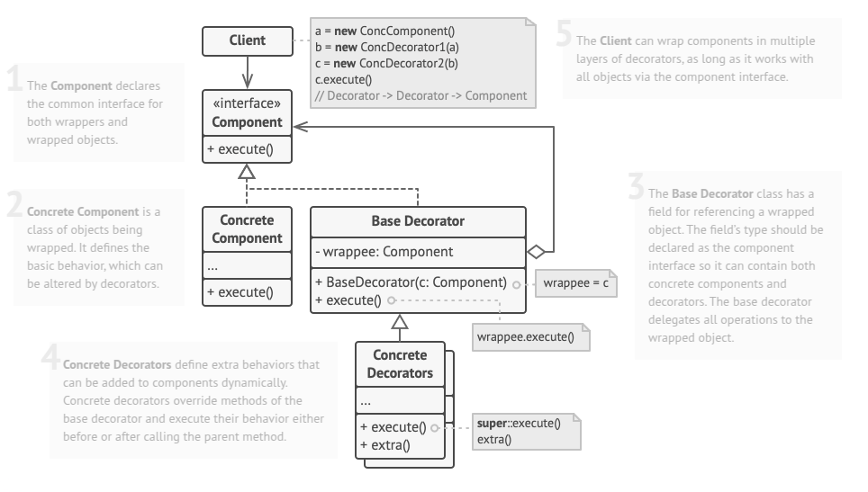

# Decorator
Decorator is a structural design pattern that lets you attach new behaviors to objects by placing these objects inside special wrapper objects that contain the behaviors.

## Problem
Imagine that you’re working on a notification library which lets other programs notify their users about important events.

The initial version of the library was based on the Notifier class that had only a few fields, a constructor and a single send method. The method could accept a message argument from a client and send the message to a list of emails that were passed to the notifier via its constructor. A third-party app which acted as a client was supposed to create and configure the notifier object once, and then use it each time something important happened.

At some point, you realize that users of the library expect more than just email notifications. Many of them would like to receive an SMS about critical issues. Others would like to be notified on Facebook and, of course, the corporate users would love to get Slack notifications.

How hard can that be? You extended the Notifier class and put the additional notification methods into new subclasses. Now the client was supposed to instantiate the desired notification class and use it for all further notifications.

But then someone reasonably asked you, “Why can’t you use several notification types at once? If your house is on fire, you’d probably want to be informed through every channel.”

You tried to address that problem by creating special subclasses which combined several notification methods within one class. However, it quickly became apparent that this approach would bloat the code immensely, not only the library code but the client code as well.

## Solution
When modifying an object's behavior, inheritance often seems like the obvious choice. However, it comes with significant limitations: it's static, meaning existing objects can't be changed at runtime, and it restricts subclasses to a single parent class. To overcome these constraints, Aggregation or Composition can be used instead. These approaches allow objects to reference others and delegate tasks dynamically, unlike inheritance, where behavior is inherited directly. This flexibility enables objects to swap helper components, alter behavior at runtime, and even integrate multiple behaviors—making these techniques fundamental to design patterns like Decorator.

The Decorator pattern, also called a "wrapper," encapsulates a target object while preserving its interface and modifying its behavior. Wrappers delegate requests to the target but can introduce additional functionality before or after forwarding them. Since each decorator follows the same interface as the wrapped object, multiple wrappers can be stacked to combine behaviors seamlessly. In a notifications system, for example, the base Notifier might handle simple email notifications while decorators enhance functionality. This approach ensures flexibility, allowing the client to structure notification behaviors dynamically without altering core logic.

## Applicability
- Use the Decorator pattern when you need to be able to assign extra behaviors to objects at runtime without breaking the code that uses these objects.
- Use the pattern when it’s awkward or not possible to extend an object’s behavior using inheritance.

## How To Implement
1. Make sure your business domain can be represented as a primary component with multiple optional layers over it.

2. Figure out what methods are common to both the primary component and the optional layers. Create a component interface and declare those methods there.

3. Create a concrete component class and define the base behavior in it.

4. Create a base decorator class. It should have a field for storing a reference to a wrapped object. The field should be declared with the component interface type to allow linking to concrete components as well as decorators. The base decorator must delegate all work to the wrapped object.

5. Make sure all classes implement the component interface.

6. Create concrete decorators by extending them from the base decorator. A concrete decorator must execute its behavior before or after the call to the parent method (which always delegates to the wrapped object).

7. The client code must be responsible for creating decorators and composing them in the way the client needs.

