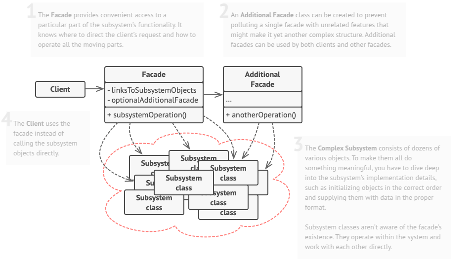

# Facade
Facade is a structural design pattern that provides a simplified interface to a library, a framework, or any other complex set of classes.

## Problem
Imagine that you must make your code work with a broad set of objects that belong to a sophisticated library or framework. Ordinarily, you’d need to initialize all of those objects, keep track of dependencies, execute methods in the correct order, and so on.

As a result, the business logic of your classes would become tightly coupled to the implementation details of 3rd-party classes, making it hard to comprehend and maintain.

## Solution
A facade is a class that simplifies access to a complex subsystem by offering a streamlined interface. While it may not expose the full range of functionality available in the subsystem, it focuses on the features most relevant to clients. This abstraction helps manage complexity, making interactions with intricate libraries more intuitive and efficient.

Facades are particularly useful when integrating an application with a sophisticated system that offers numerous capabilities, but only a fraction of them are needed. For example, an app designed to upload short cat videos to social media might require video conversion but not advanced editing tools. Instead of interacting with an extensive video processing library, the app could implement a class with a single method, `encode(filename, format)`, to handle the essential functionality—effectively creating a facade for the library.

## Applicability
- Use the Facade pattern when you need to have a limited but straightforward interface to a complex subsystem.
- Use the Facade when you want to structure a subsystem into layers.

## How To Implement
1. Check whether it’s possible to provide a simpler interface than what an existing subsystem already provides. You’re on the right track if this interface makes the client code independent from many of the subsystem’s classes.

2. Declare and implement this interface in a new facade class. The facade should redirect the calls from the client code to appropriate objects of the subsystem. The facade should be responsible for initializing the subsystem and managing its further life cycle unless the client code already does this.

3. To get the full benefit from the pattern, make all the client code communicate with the subsystem only via the facade. Now the client code is protected from any changes in the subsystem code. For example, when a subsystem gets upgraded to a new version, you will only need to modify the code in the facade.

4. If the facade becomes too big, consider extracting part of its behavior to a new, refined facade class.