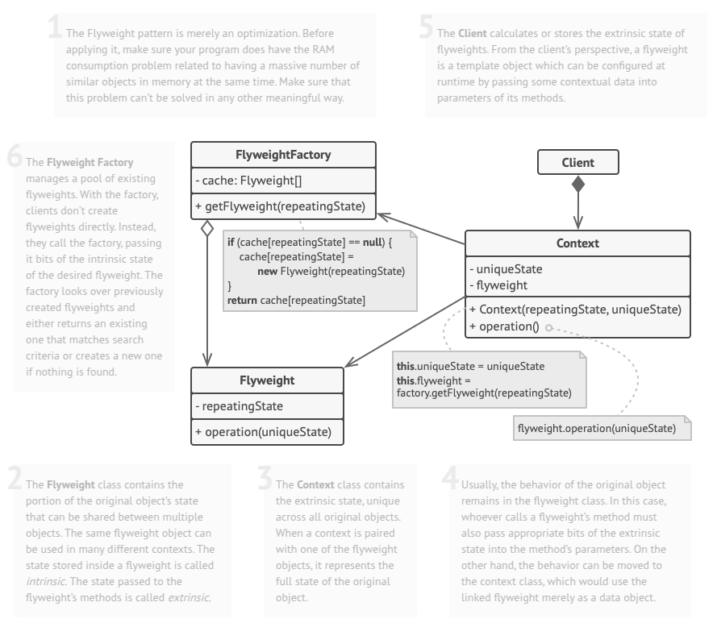

# Flyweight
Flyweight is a structural design pattern that lets you fit more objects into the available amount of RAM by sharing common parts of state between multiple objects instead of keeping all of the data in each object.

## Problem
To have some fun after long working hours, you decided to create a simple video game: players would be moving around a map and shooting each other. You chose to implement a realistic particle system and make it a distinctive feature of the game. Vast quantities of bullets, missiles, and shrapnel from explosions should fly all over the map and deliver a thrilling experience to the player.

Upon its completion, you pushed the last commit, built the game and sent it to your friend for a test drive. Although the game was running flawlessly on your machine, your friend wasn’t able to play for long. On his computer, the game kept crashing after a few minutes of gameplay. After spending several hours digging through debug logs, you discovered that the game crashed because of an insufficient amount of RAM. It turned out that your friend’s rig was much less powerful than your own computer, and that’s why the problem emerged so quickly on his machine.

The actual problem was related to your particle system. Each particle, such as a bullet, a missile or a piece of shrapnel was represented by a separate object containing plenty of data. At some point, when the carnage on a player’s screen reached its climax, newly created particles no longer fit into the remaining RAM, so the program crashed.

## Solution
In the Particle class, certain fields like color and sprite consume significant memory while remaining constant across all instances. Other properties, such as coordinates and movement vectors, are dynamic and change over time. This distinction defines an object's intrinsic state, which is fixed and reusable, and its extrinsic state, which varies based on external factors. The Flyweight pattern optimizes memory usage by shifting extrinsic state storage outside the object and passing it to methods when needed. As a result, fewer objects are required, since they only maintain intrinsic state, reducing redundancy while improving efficiency.

Applying this principle to a game, particles such as bullets, missiles, and shrapnel could be represented using just three flyweight objects. Their extrinsic state—position, speed, and movement vectors—would be stored in the main game container instead of individual particles. To synchronize this data, the container could use arrays or a dedicated context class, ensuring that each contextual object references the appropriate flyweight. Although many small contextual objects are still needed, they are far more memory-efficient than storing complete particle instances. To streamline access, a factory method can manage a pool of flyweight objects, retrieving or creating them as needed. This approach ensures optimal resource utilization while maintaining flexibility across different contexts.

## Applicability
- Use the Flyweight pattern only when your program must support a huge number of objects which barely fit into available RAM.

## How To Implement
1. Divide fields of a class that will become a flyweight into two parts:

   * the intrinsic state: the fields that contain unchanging data duplicated across many objects 
   * the extrinsic state: the fields that contain contextual data unique to each object

2. Leave the fields that represent the intrinsic state in the class, but make sure they’re immutable. They should take their initial values only inside the constructor.

3. Go over methods that use fields of the extrinsic state. For each field used in the method, introduce a new parameter and use it instead of the field.

4. Optionally, create a factory class to manage the pool of flyweights. It should check for an existing flyweight before creating a new one. Once the factory is in place, clients must only request flyweights through it. They should describe the desired flyweight by passing its intrinsic state to the factory.

5. The client must store or calculate values of the extrinsic state (context) to be able to call methods of flyweight objects. For the sake of convenience, the extrinsic state along with the flyweight-referencing field may be moved to a separate context class.

