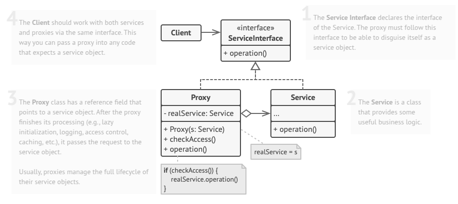

# Proxy
Proxy is a structural design pattern that lets you provide a substitute or placeholder for another object. A proxy controls access to the original object, allowing you to perform something either before or after the request gets through to the original object.

## Problem
Why would you want to control access to an object? Here is an example: you have a massive object that consumes a vast amount of system resources. You need it from time to time, but not always.

You could implement lazy initialization: create this object only when it’s actually needed. All of the object’s clients would need to execute some deferred initialization code. Unfortunately, this would probably cause a lot of code duplication.

In an ideal world, we’d want to put this code directly into our object’s class, but that isn’t always possible. For instance, the class may be part of a closed 3rd-party library.

## Solution
The Proxy pattern involves creating a proxy class that mirrors the interface of the original service object. Instead of interacting with the real object directly, clients receive a proxy, which handles requests by instantiating the actual service object and delegating tasks to it. This approach ensures seamless integration without requiring modifications to existing client code.

The key advantage of using a proxy is its ability to introduce additional logic before or after the primary operations of the service class. Whether for logging, access control, caching, or lazy initialization, proxies enhance functionality without altering the original class. Since they maintain the same interface as the real object, they can be easily swapped in without disrupting the system, making them a versatile tool for managing object interactions efficiently.

## Applicability
- Lazy initialization (virtual proxy). This is when you have a heavyweight service object that wastes system resources by being always up, even though you only need it from time to time.
- Access control (protection proxy). This is when you want only specific clients to be able to use the service object; for instance, when your objects are crucial parts of an operating system and clients are various launched applications (including malicious ones).
- Local execution of a remote service (remote proxy). This is when the service object is located on a remote server.
- Logging requests (logging proxy). This is when you want to keep a history of requests to the service object.
- Caching request results (caching proxy). This is when you need to cache results of client requests and manage the life cycle of this cache, especially if results are quite large.
- Smart reference. This is when you need to be able to dismiss a heavyweight object once there are no clients that use it.

## How To Implement
1. If there’s no pre-existing service interface, create one to make proxy and service objects interchangeable. Extracting the interface from the service class isn’t always possible, because you’d need to change all of the service’s clients to use that interface. Plan B is to make the proxy a subclass of the service class, and this way it’ll inherit the interface of the service.

2. Create the proxy class. It should have a field for storing a reference to the service. Usually, proxies create and manage the whole life cycle of their services. On rare occasions, a service is passed to the proxy via a constructor by the client.

3. Implement the proxy methods according to their purposes. In most cases, after doing some work, the proxy should delegate the work to the service object.

4. Consider introducing a creation method that decides whether the client gets a proxy or a real service. This can be a simple static method in the proxy class or a full-blown factory method.

5. Consider implementing lazy initialization for the service object.